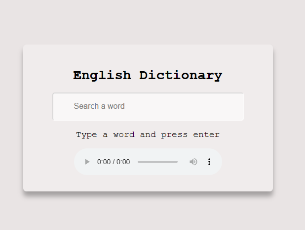
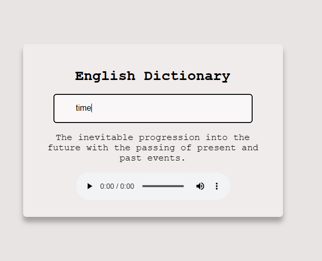

# English-Dictionary

## Description
This simple English dictionary web application allows users to search for word definitions and listen to the pronunciation of words. It's built using JavaScript and utilizes a dictionary API to fetch word definitions and audio pronunciations.

## Features
1. Word Definitions
Enter a word in the search bar to instantly retrieve its definition.
2. Audio Pronunciation
Click the speaker icon next to a word to hear its correct pronunciation.
3. User-Friendly Interface
The application features an intuitive and user-friendly design, making it easy for anyone to look up words.

## Usage
1. Word Search: Enter a word in the search bar and press "Enter".

2. Word Definition: The definition of the word will be displayed below the search bar.

3. Audio Pronunciation: Click the speaker icon next to the word to hear its pronunciation.

## API Reference
This application uses a dictionary API to fetch word definitions and audio pronunciations. You can replace the API endpoints and authentication with your preferred dictionary API.